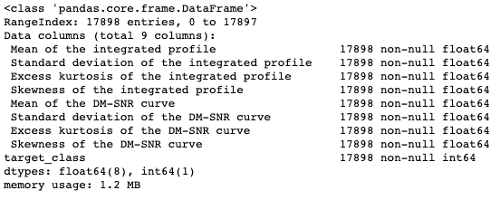

# Pulsar Star Classification

Pulsar stars are some of the most interesting structures in our universe. As a subset of Neutron stars, they exist somewhere between the typical condensed white dwarfs that stars like our sun will turn into at the end of they're life cycle, but aren't so dense that they're gravity reverses on itself, which results in a black hole. Pulsars are neutron stars that exhibit periodic radio signals that our telescopes on earth can read, but as there are many radio producing objects our our universe, separating these signals from the noise can be very complicated for human researchers. Our aim here is to utilize differing machine learning libraries, and find the most accurate one, for determining which of these periodic signals are pulsar stars that we should direct our telescopes towards for further research, and which signals are ambient noise.

## EDA

Our process begins with some exploratory data analysis, where we see that we have a number of floating point values for the 8 features in our dataset, and a 'target class' column that is the true value for whether an observation is a pulsar star or not. We also looked at a color delineated scatter plot of all the features. Some of these plots show there is a clear (though not perfect) distinction of pulsar to not pulsar:

And others where the separation is not so clear:

And we also see that we have a total of just under 18K observations to work with

## Data Transformation and Baseline Model

We ran our dataset through a StandardScalar object to normalize our dataset and did a grid search on a Random Forest classifier as a baseline for our predictive analysis. We ended up with a 97.8% accuracy score

## Neural Network Implementation

We then made a simple neural network with a single layer which surprisingly landed us with a 95% accuracy rate with no real tuning

To improve on this, we created a neural network with 3 hidden layers, 100 neurons in each, and LeakyReLu activation functions on all layers, bringing us up to a 97.8% accuracy rate, which was still no better than our baseline Random Forest

## Stacked Ensemble Implementation

We decided to implement a stacked ensemble model instead, to improve our accuracy at pulsar classification. We utilized two different train/test splits, a 90/10 and a 70/30, and ran each through a variety of (grid searched for best parameters) ML and deep learning algorithms. Those outputs on the entire dataset were then fed to a separate neural network, which made it's own prediction of the classification. The structure described is below:

And as you can see, we saw significant improvement in our classification from this stacked model

With our stacked model, we were able to acheive an accuracy score of 99.4% significantly reducing our chances of chasing down signals that aren't the stars we want to study, and ensuring that we miss far fewer of the stars that could be significant to our future studies of the cosmos!